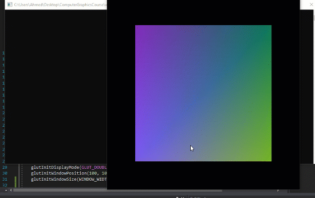

# ComputerGraphicsCourse

### Assignment 1
**Description:** Draw as much regular polygons as you can.

I created a function called `drawPolygon` which takes an `int` as a parameter and creates a regular polygon that has the same number of sides as the parameter.

Each time you click on the screen, the number of sides for the polygon drawn increases by one.

