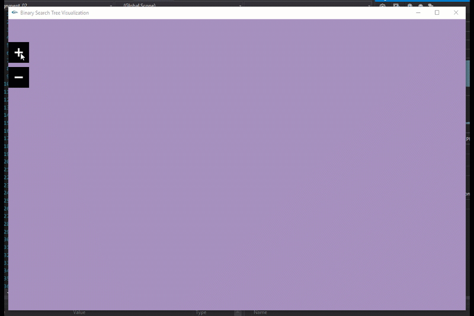
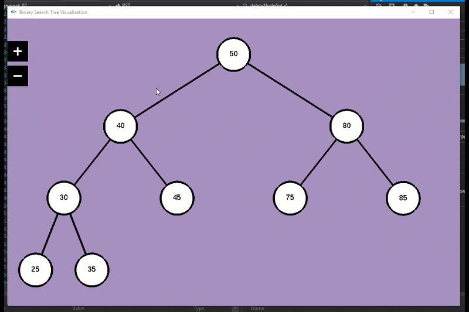

# Binary Search Tree Visualization
**Description:** An interactive visualization for BST.

### How it Works
When you run the code you will find two buttons on the upper left corner.

**First button:** Opens a modal where you can add a node.
**Second button:** Opens a modal where you can delete a node.

You can add as many nodes as you want, the tree will resize based on the current number of levels it has.

#### Adding nodes preview

#### Deleting nodes preview

### [Demo video](https://youtu.be/uqg4QhZ1AEE)